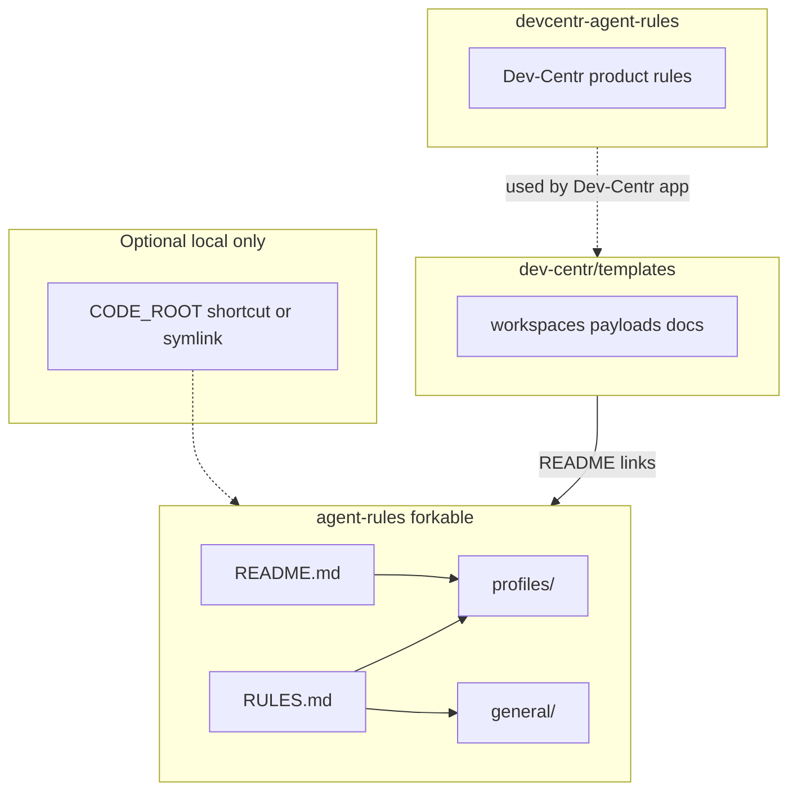

# Agent rules

Canonical **forkable agent rules** and **profiles** for coding assistants under Dev-Centr. Content is meant to be read by agents (from disk) or pasted into an app’s rules field.

**Fork** this repository to your own org or user when you need a private or personalized copy (for example [`AMDphreak/agent-rules`](https://github.com/AMDphreak/agent-rules)). Upstream portable improvements with pull requests here.

**Dev-Centr product behavior** (when the app acts on behalf of the user) does **not** live here. It belongs in [dev-centr/devcentr-agent-rules](https://github.com/dev-centr/devcentr-agent-rules).

## Architecture



- **agent-rules** (this repository): shared forkable end-user instructions and profiles.
- **devcentr-agent-rules**: rules for when the Dev-Centr app acts on behalf of the user (separate repository).
- **templates**: project templates; README there links to forkable agent rules, not to personal copies.

## Quick start

1. Clone into your code hive, for example `$CODE_ROOT/github.com/<your-username>/agent-rules` (see `general/folder-schema.md`).
2. Optional: on Windows, a directory junction can point at this clone for a short path (for example `mklink /J Z:\code\agent-rules <path-to-this-repo>`).
3. Copy `profiles/my-desktop.md` or `profiles/my-laptop.md` to a name you like, set **constants** (`CODE_ROOT`, `GITHUB_USER`, `ISSUES_REPO`, **`ENVIRONMENT`** …). Set **`ENVIRONMENT`** to `windows`, `mac`, or `linux` so the agent loads the matching `general/windows.md`, `general/mac.md`, or `general/linux.md`.
4. **`RULES.md` is written for the agent**. It serves as a preamble that commands the AI to assemble its context in one step.
5. In your AI agent's system prompt or custom instructions field, paste the contents of **`RULES.md`**. Before saving, fill in the **Dev Configuration** section at the top of the pasted block with your actual `CODE_ROOT` and `AGENT_RULES_PATH`.

### Profile constants (your `profiles/*.md`)

| Constant | Required? | Purpose |
|----------|-----------|---------|
| `CODE_ROOT` | Yes | Root directory where you clone Git repos (see `general/folder-schema.md`). |
| `ENVIRONMENT` | Yes | `windows`, `mac`, or `linux` — selects `general/windows.md`, `general/mac.md`, or `general/linux.md`. |
| `GITHUB_USER` | No | Your username for path examples and org layouts. |
| `ISSUES_REPO` | No | Path to your `.issues` repo if you use that workflow. |

## Pointing the agent at this repository

This repository uses a **1-step assembly architecture** optimized for local AI harnesses (e.g., Cursor, Windsurf, VSCode, Antigravity) that have filesystem access.

When you paste `RULES.md` into your agent and define `$AGENT_RULES_PATH`, you are commanding the AI to perform a batched semantic read of all foundational modules simultaneously using its native tools (e.g., `view_file`, `read_file`). This prevents multi-turn ping-pong delays and avoids the common truncation issues associated with traditional CLI `cat` output.

The agent will automatically pull:

1. `profiles/<infer-profile-name>.md`
2. `general/global.md`
3. `general/environment.md`
4. `general/<windows|mac|linux>.md`
5. `general/creator.md`
6. `general/folder-schema.md`
(and `general/documentation.md` selectively).

Create a **machine-local** `MEMORIES.md` in this repository root (gitignored) for facts that rarely change. See **Machine-local memories** below.

For **Dev-Centr automation** acting on behalf of the user, the product should load rules from [devcentr-agent-rules](https://github.com/dev-centr/devcentr-agent-rules), not from this forkable repo.

## Machine-local memories

`MEMORIES.md` in the **repository root** is **gitignored**. Use it for durable facts about **this machine**, not for project tickets.

Example line:

```text
my-org is a GitHub org; clones live under $CODE_ROOT/github.com/my-org/
```

Adjust the path to match your `CODE_ROOT` and layout.

## Relation to Dev-Centr templates

Project templates (workspaces, payloads, template docs) live in [dev-centr/templates](https://github.com/dev-centr/templates). That repo **links** to agent rules here; it should not embed a second copy of personal rules.

## License

Add a license file if you want this repository to be reusable by others.
