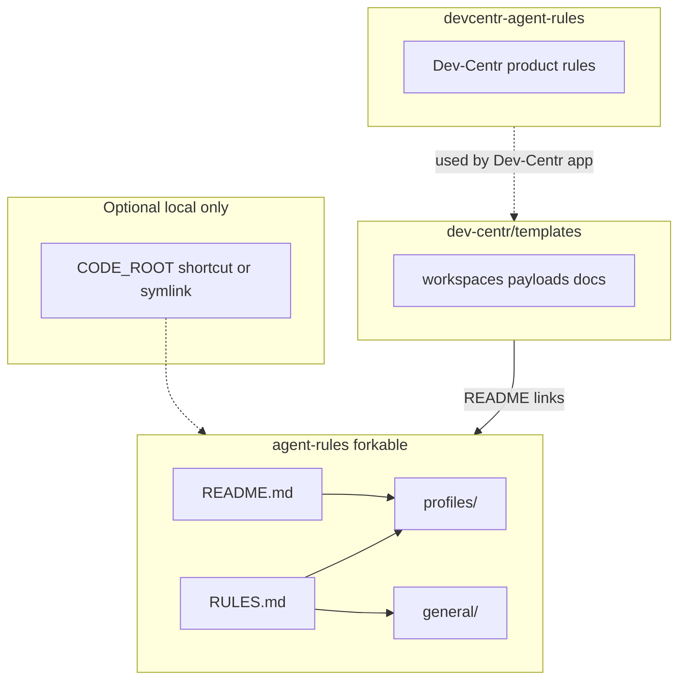

# Agent rules

Canonical **forkable agent rules** and **profiles** for coding assistants under Dev-Centr. Content is meant to be read by agents (from disk) or pasted into an app’s rules field.

**Fork** this repository to your own org or user when you need a private or personalized copy (for example [`AMDphreak/agent-rules`](https://github.com/AMDphreak/agent-rules)). Upstream portable improvements with pull requests here.

**Dev-Centr product behavior** (when the app acts on behalf of the user) does **not** live here. It belongs in [dev-centr/devcentr-agent-rules](https://github.com/dev-centr/devcentr-agent-rules).

## Architecture



- **agent-rules** (this repository): shared forkable end-user instructions and profiles.
- **devcentr-agent-rules**: rules for when the Dev-Centr app acts on behalf of the user (separate repository).
- **templates**: project templates; README there links to forkable agent rules, not to personal copies.

## Quick start

1. Clone into your code hive, for example `$CODE_ROOT/github.com/<your-username>/agent-rules` (see `general/folder-schema.md`).
2. Optional: on Windows, a directory junction can point at this clone for a short path (for example `mklink /J Z:\code\agent-rules <path-to-this-repo>`).
3. Copy `profiles/my-desktop.md` or `profiles/my-laptop.md` to a name you like, set **constants** (`CODE_ROOT`, `GITHUB_USER`, `ISSUES_REPO`, **`ENVIRONMENT`** …). Set **`ENVIRONMENT`** to `windows`, `mac`, or `linux` so the agent loads the matching `general/windows.md`, `general/mac.md`, or `general/linux.md`.
4. **`RULES.md` is written for the agent** (imperative instructions to the model). Human-facing setup lives in this README.
5. If your agent only accepts a single text blob, paste **`RULES.md`** into its rules or settings field. It still addresses the agent; you are only providing the transport.

## Read order in this repository

When the agent can read files from the clone, use this order:

1. `profiles/<your-profile>.md` — machine constants, including **`ENVIRONMENT`** (`windows` \| `mac` \| `linux`).
2. `general/global.md` — baseline expectations.
3. `general/environment.md` — cross-platform environment principles.
4. **One** of `general/windows.md`, `general/mac.md`, or `general/linux.md` — chosen by `ENVIRONMENT`.
5. `general/creator.md` — rules for projects you own.
6. `general/folder-schema.md` — path patterns (uses `CODE_ROOT`).
7. `general/documentation.md` — when authoring or publishing docs (optional; Diátaxis, Antora when relevant).

Create a **machine-local** `MEMORIES.md` in this repository root (gitignored) for facts that rarely change. See **Machine-local memories** below.

For **Dev-Centr automation** acting on behalf of the user, the product should load rules from [devcentr-agent-rules](https://github.com/dev-centr/devcentr-agent-rules), not from this forkable repo.

## Machine-local memories

`MEMORIES.md` in the **repository root** is **gitignored**. Use it for durable facts about **this machine**, not for project tickets.

Example line:

```text
my-org is a GitHub org; clones live under $CODE_ROOT/github.com/my-org/
```

Adjust the path to match your `CODE_ROOT` and layout.

## Relation to Dev-Centr templates

Project templates (workspaces, payloads, template docs) live in [dev-centr/templates](https://github.com/dev-centr/templates). That repo **links** to agent rules here; it should not embed a second copy of personal rules.

## License

Add a license file if you want this repository to be reusable by others.
