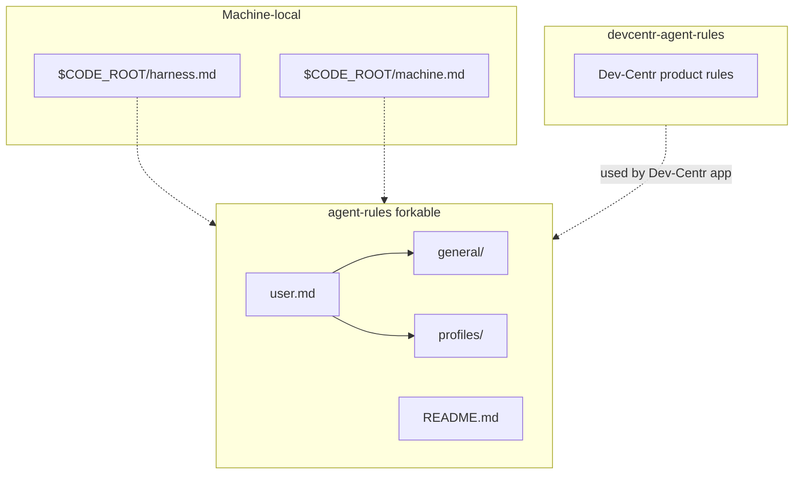

  
  
  
  

  <h1>Agent Rules</h1>
  
Forkable, harness-neutral agent rules — <code>user.md</code>, <code>harness.md</code>, <code>machine.md</code> layers; 1-step assembly for local AI coding assistants.

  

    <a href="https://docs.devcentr.org/agent-rules/"><strong>Explore the docs »</strong></a>
      
    <a href="https://docs.devcentr.org/agent-rules/harness-neutral.html"><strong>Harness-neutral architecture »</strong></a>
      
    <a href="https://github.com/dev-centr/agent-rules/issues">Report Bug</a>
    &middot;
    <a href="https://github.com/dev-centr/agent-rules/issues">Request Feature</a>
  

  
Table of Contents

  <ol>
    <li>
      <a href="#about-the-project">About The Project</a>
      <ul>
        <li><a href="#built-with">Built With</a></li>
      </ul>
    </li>
    <li><a href="#installation">Installation</a></li>
    <li><a href="#usage">Usage</a></li>
    <li><a href="#agent-skills">Agent skills</a></li>
    <li><a href="#changelog">Changelog</a></li>
    <li><a href="#contributing">Contributing</a></li>
    <li><a href="#contact">Contact</a></li>
  </ol>

## Layer names vs harness vocabulary

Our files name **layers**; harness products say **rules** a lot. Full table: https://docs.devcentr.org/agent-rules/harness-neutral.html#layer-names-vs-harness-vocabulary

| Our layer | File | Typical harness equivalent |
|-----------|------|----------------------------|
| **User** | [`user.md`](user.md) | Cursor **User Rules**; Claude user `CLAUDE.md`; system prompt / custom instructions |
| **Harness** | `$CODE_ROOT/harness.md` | Injection + discovery wiring (`ALWAYS_ON_RULES` in harness.md) |
| **Machine** | `$CODE_ROOT/machine.md` | Local env notes — **not** synced User Rules |
| **Org** | [`AGENTS.md`](AGENTS.md) | Stacked after user.md in always-on slot |
| **Project** | `<repo>/AGENTS.md` | Cursor `.cursor/rules/*.mdc`; project `CLAUDE.md` |

**`user.md`** = portable policy *content*. **`harness.md`** = where that content is *injected* on this machine. Core templates stay **`.md`**; **`.mdc`** is for Cursor-local adapters only (see docs).

(<a href="#readme-top">back to top</a>)

## About The Project

Canonical **forkable agent rules** and **profiles** for coding assistants under Dev-Centr. Content is meant to be read by agents (from disk) or pasted into an app's rules field. **Harness-neutral:** templates do not assume Cursor, Claude Code, Hermes, or any single AI toolkit — machine and harness facts live in `$CODE_ROOT/harness.md` and `$CODE_ROOT/machine.md`.

**Org wrapper (house init):** each org this hive owns gets `{org}/agent-rules` with a pointer README and a thin org `AGENTS.md` — **no git submodule** (a SHA pin goes stale). Not a requirement for every GitHub org. `{org}/.github/AGENT-RULES.md` points at the wrapper. Shared rules stay in this repo; clone/fetch it. Script: `scripts/setup-org-agent-rules-wrapper.ps1`. Fork only when you need a *diverging* private tree.

Docs: https://docs.devcentr.org/agent-rules/ — start with **[Harness-neutral architecture](https://docs.devcentr.org/agent-rules/harness-neutral.html)** (illustrated guide).

**Dev-Centr product behavior** (when the app acts on behalf of the user) does **not** live here. It belongs in [dev-centr/devcentr-agent-rules](https://github.com/dev-centr/devcentr-agent-rules).

### Architecture

```mermaid
flowchart TB
  subgraph forkable [agent-rules forkable]
    G[general/]
    P[profiles/]
    R[user.md]
    M[README.md]
  end
  subgraph machine [Machine-local]
    H["$CODE_ROOT/harness.md"]
    MEM["$CODE_ROOT/machine.md"]
  end
  subgraph product [devcentr-agent-rules]
    X[Dev-Centr product rules]
  end
  R --> G
  R --> P
  H -.-> forkable
  MEM -.-> forkable
  product -.->|used by Dev-Centr app| forkable
```

- **agent-rules** (this repository): portable rules (`user.md`, `general/`, `profiles/`) **and** org layer (`AGENTS.md`, `agents/`, org `skills/`). Satellite orgs clone/fetch `dev-centr/agent-rules` as `AGENT_RULES_PATH` — wrapper repos hold only org overlay text.
- **devcentr-agent-rules**: rules for when the Dev-Centr app acts on behalf of the user (separate repository).
- **harness.md** + **machine.md**: this user's machine; never commit. See `harness.example.md` and `machine.example.md`.

### Built With

* **Rules format** — Markdown modules under `general/` and `profiles/`
* **Assembly** — paste `user.md`, or compose via [rules-manager](https://github.com/dev-centr/rules-manager)
* **Harness setup** — skill `harness-setup` populates `$CODE_ROOT/harness.md`
* **Optional template blanks** — [readme-template](https://github.com/dev-centr/readme-template)

(<a href="#readme-top">back to top</a>)

## Installation

1. Clone into your code hive, for example `$CODE_ROOT/github.com/<your-username>/agent-rules` (see `general/folder-schema.md`).
2. Optional path convenience: on Windows, a directory junction can point at this clone. **Junctions are temporary.** Prefer configuring [`dev-centr/rules-manager`](https://github.com/dev-centr/rules-manager) (`rules_repo_path`) to compose and watch global + machine sections into `$CODE_ROOT/agent-rules.composed.md`.
3. Copy `profiles/my-desktop.md` or `profiles/my-laptop.md` to a name you like, set **constants** (`CODE_ROOT`, `GITHUB_USER`, `ISSUES_REPO`, **`ENVIRONMENT`** …).
4. Run skill **`harness-setup`** (or copy `harness.example.md` → `$CODE_ROOT/harness.md`) so the agent records harness discovery paths and chat behaviors on **this machine**.
5. **`user.md` is written for the agent**. Paste it (or the composed file) into your harness always-on rules slot. Fill Constants before saving.
6. Optional: agent skills — start at [`skills/BOOTSTRAP.md`](./skills/BOOTSTRAP.md); install per `$harness.md`; keep skill bodies out of always-on rules.

### Profile constants (your `profiles/*.md`)

| Constant | Required? | Purpose |
|----------|-----------|---------|
| `CODE_ROOT` | Yes | Root directory where you clone Git repos (see `general/folder-schema.md`). |
| `ENVIRONMENT` | Yes | `windows`, `mac`, or `linux` — selects `general/windows.md`, `general/mac.md`, or `general/linux.md`. |
| `GITHUB_USER` | No | Your username for path examples and org layouts. |
| `ISSUES_REPO` | No | Path to your `.issues` repo if you use that workflow. |

(<a href="#readme-top">back to top</a>)

## Usage

### Pointing the agent at this repository

This repository uses a **1-step assembly architecture** optimized for local AI harnesses (Cursor, Claude Code, Hermes, T3code, Windsurf, and others) that have filesystem access.

When you paste `user.md` into your agent and define `$AGENT_RULES_PATH`, you command the AI to perform a batched read of foundational modules simultaneously using native file tools.

The agent will automatically pull:

1. `profiles/<infer-profile-name>.md`
2. `$CODE_ROOT/harness.md` and `$CODE_ROOT/machine.md`
3. `general/harness.md`, `general/harness-boundary.md`, `general/global.md`
4. `general/environment.md`, `general/<windows|mac|linux>.md`, `general/creator.md`, `general/folder-schema.md`
5. (when docs) `general/documentation.md`
6. Heavy playbooks: agent skills — see `skills/CATALOG.md`

**Illustrated guide:** https://docs.devcentr.org/agent-rules/harness-neutral.html

For **Dev-Centr automation** acting on behalf of the user, load [devcentr-agent-rules](https://github.com/dev-centr/devcentr-agent-rules), not this repository.

### Machine-local files

| File | Purpose |
|------|---------|
| `$CODE_ROOT/harness.md` | Harness name, skill discovery, always-on slot, chat/citation behaviors |
| `$CODE_ROOT/machine.md` | Workstation facts — tool paths, PATH gaps, hardware |

Templates: [harness.example.md](./harness.example.md), [machine.example.md](./machine.example.md). Never commit either file.

### Satellite orgs (no wrapper changes needed)

Orgs with `{org}/agent-rules` **pointer overlays** resolve `AGENT_RULES_PATH` to `dev-centr/agent-rules`. **`git pull` in the canonical clone** picks up shared portable + org policy; wrapper repos only hold org-specific `AGENTS.md` diffs.

(<a href="#readme-top">back to top</a>)

## Agent skills

Optional, on-demand curricula live under `skills/` and are **not** part of `user.md` / `MAIN.md` assembly.

- Shop file: [`skills/BOOTSTRAP.md`](./skills/BOOTSTRAP.md)
- Harness setup: skill `harness-setup`
- Hub docs: https://docs.devcentr.org/agent-rules/harness-neutral.html
- Authoring skills: `write-a-skill` — YAML `description` is trigger words, not a lay blurb
- Release tags: skill `tag-release`

(<a href="#readme-top">back to top</a>)

## Changelog

Functional history (including the `RULES.md` → `user.md` / `MEMORIES` → `machine.md` / harness layer rename) lives in the Antora docs:

- Hub: https://docs.devcentr.org/agent-rules/changelog.html
- Source: [`docs/modules/ROOT/pages/changelog.adoc`](docs/modules/ROOT/pages/changelog.adoc)

(<a href="#readme-top">back to top</a>)

## Contributing

Portable rule improvements welcome as pull requests. Do not embed machine paths or harness-specific install steps in forkable templates — use placeholders and `$harness.md`. Record functional changes with skill `owned-changelog`.

(<a href="#readme-top">back to top</a>)

## Contact

DevCentr.org - support@devcentr.org

Project Link: https://github.com/dev-centr/agent-rules

Site: https://devcentr.org

(<a href="#readme-top">back to top</a>)

