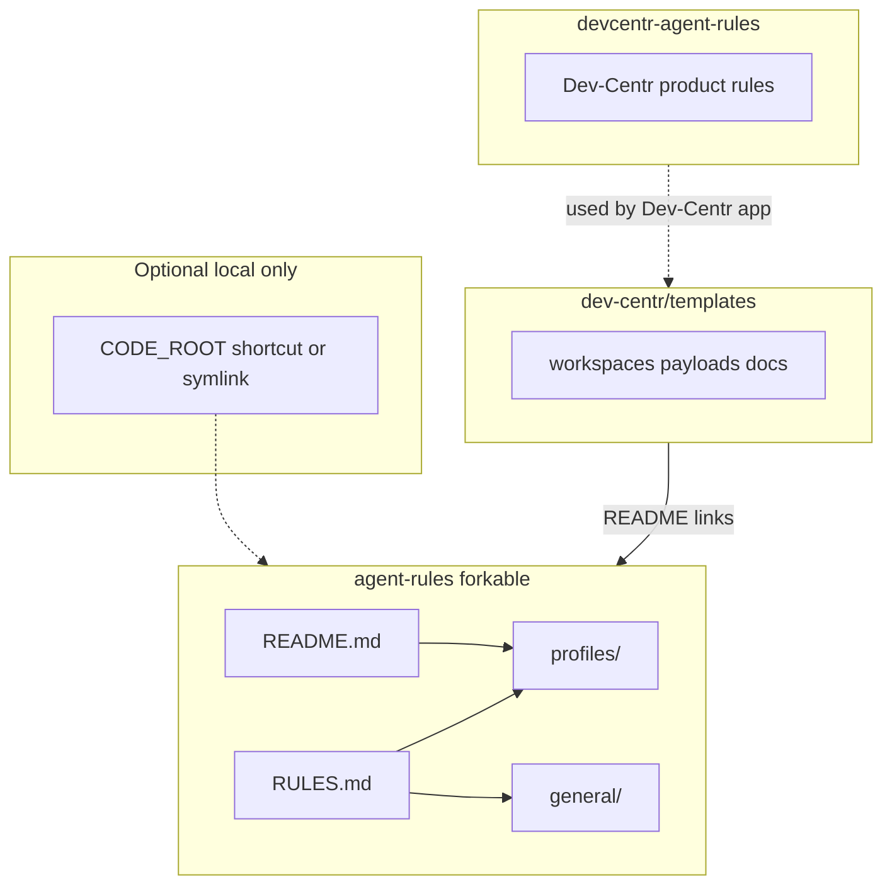

<a id="readme-top"></a>
<div align="center">
  <a href="https://github.com/dev-centr/agent-rules/graphs/contributors"></a>
  <a href="https://github.com/dev-centr/agent-rules/network/members"></a>
  <a href="https://github.com/dev-centr/agent-rules/stargazers"></a>
  <a href="https://github.com/dev-centr/agent-rules/issues"></a>

  <h1>Agent Rules</h1>
  <p>Forkable modular agent rules with 1-step assembly for local AI coding assistants.</p>
  <p>
    <a href="https://docs.devcentr.org/agent-rules/"><strong>Explore the docs »</strong></a>
    <br /><br />
    <a href="https://github.com/dev-centr/agent-rules/issues">Report Bug</a>
    &middot;
    <a href="https://github.com/dev-centr/agent-rules/issues">Request Feature</a>
  </p>
</div>

<details>
  <summary>Table of Contents</summary>
  <ol>
    <li>
      <a href="#about-the-project">About The Project</a>
      <ul>
        <li><a href="#built-with">Built With</a></li>
      </ul>
    </li>
    <li><a href="#installation">Installation</a></li>
    <li><a href="#usage">Usage</a></li>
    <li><a href="#cursor-skills">Cursor skills</a></li>
    <li><a href="#contributing">Contributing</a></li>
    <li><a href="#contact">Contact</a></li>
  </ol>
</details>

## About The Project

Canonical **forkable agent rules** and **profiles** for coding assistants under Dev-Centr. Content is meant to be read by agents (from disk) or pasted into an app's rules field.

**Fork** this repository to your own org or user when you need a private or personalized copy. Upstream portable improvements with pull requests here.

Docs: https://docs.devcentr.org/agent-rules/

**Dev-Centr product behavior** (when the app acts on behalf of the user) does **not** live here. It belongs in [dev-centr/devcentr-agent-rules](https://github.com/dev-centr/devcentr-agent-rules).

### Architecture


```mermaid
flowchart TB
  subgraph forkable [agent-rules forkable]
    G[general/]
    P[profiles/]
    R[RULES.md]
    M[README.md]
  end
  subgraph product [devcentr-agent-rules]
    X[Dev-Centr product rules]
  end
  subgraph personal [Optional local only]
    Z[CODE_ROOT shortcut or symlink]
  end
  subgraph other [dev-centr/templates]
    W[workspaces payloads docs]
  end
  M --> P
  R --> P
  R --> G
  Z -.-> forkable
  other -->|README links| forkable
  product -.->|used by Dev-Centr app| other
```

- **agent-rules** (this repository): shared forkable end-user instructions and profiles.
- **devcentr-agent-rules**: rules for when the Dev-Centr app acts on behalf of the user (separate repository).
- **templates**: project templates; README there links to forkable agent rules, not to personal copies.

### Built With

* **Rules format** — Markdown modules under `general/` and `profiles/`
* **Assembly** — paste `RULES.md`, or compose via [rules-manager](https://github.com/dev-centr/rules-manager)
* **Optional template blanks** — [readme-template](https://github.com/dev-centr/readme-template)

<p align="right">(<a href="#readme-top">back to top</a>)</p>

## Installation

1. Clone into your code hive, for example `$CODE_ROOT/github.com/<your-username>/agent-rules` (see `general/folder-schema.md`).
2. Optional path convenience: on Windows, a directory junction can point at this clone (for example `mklink /J …\agent-rules <path-to-this-repo>`). **Junctions are temporary.** Prefer configuring [`dev-centr/rules-manager`](https://github.com/dev-centr/rules-manager) (`rules_repo_path`) to compose and watch global + machine sections into `$CODE_ROOT/agent-rules.composed.md`.
3. Copy `profiles/my-desktop.md` or `profiles/my-laptop.md` to a name you like, set **constants** (`CODE_ROOT`, `GITHUB_USER`, `ISSUES_REPO`, **`ENVIRONMENT`** …). Set **`ENVIRONMENT`** to `windows`, `mac`, or `linux` so the agent loads the matching `general/windows.md`, `general/mac.md`, or `general/linux.md`.
4. **`RULES.md` is written for the agent**. It serves as a preamble that commands the AI to assemble its context in one step.
5. In your AI agent's system prompt or custom instructions field, paste the contents of **`RULES.md`** (or the composed file from rules-manager). Before saving, fill in the **Dev Configuration** section at the top of the pasted block with your actual `CODE_ROOT` and `AGENT_RULES_PATH`.
6. Optional: Cursor skills — start at [`skills/BOOTSTRAP.md`](./skills/BOOTSTRAP.md) (junction into `~/.cursor/skills/`; keep skill bodies out of always-on User Rules).

### Profile constants (your `profiles/*.md`)

| Constant | Required? | Purpose |
|----------|-----------|---------|
| `CODE_ROOT` | Yes | Root directory where you clone Git repos (see `general/folder-schema.md`). |
| `ENVIRONMENT` | Yes | `windows`, `mac`, or `linux` — selects `general/windows.md`, `general/mac.md`, or `general/linux.md`. |
| `GITHUB_USER` | No | Your username for path examples and org layouts. |
| `ISSUES_REPO` | No | Path to your `.issues` repo if you use that workflow. |

<p align="right">(<a href="#readme-top">back to top</a>)</p>

## Usage

### Pointing the agent at this repository

This repository uses a **1-step assembly architecture** optimized for local AI harnesses (e.g., Cursor, Windsurf, VSCode, Antigravity) that have filesystem access.

When you paste `RULES.md` into your agent and define `$AGENT_RULES_PATH`, you are commanding the AI to perform a batched semantic read of all foundational modules simultaneously using its native tools (e.g., `view_file`, `read_file`). This prevents multi-turn ping-pong delays and avoids the common truncation issues associated with traditional CLI `cat` output.

The agent will automatically pull:

1. `profiles/<infer-profile-name>.md`
2. `general/global.md`
3. `general/environment.md`
4. `general/<windows|mac|linux>.md`
5. `general/creator.md`
6. `general/folder-schema.md`
(and `general/documentation.md` / `general/app-architecture.md` selectively).

Create **`$CODE_ROOT/MEMORIES.md`** for workstation facts (see **Machine-local memories** below). Do not commit per-repo `MEMORIES.md`.

For **Dev-Centr automation** acting on behalf of the user, the product should load rules from [devcentr-agent-rules](https://github.com/dev-centr/devcentr-agent-rules), not from this repository.

### Machine-local memories

Canonical file: **`$CODE_ROOT/MEMORIES.md`**. Workstation-only; never commit.

Committed template / format: [MEMORIES.example.md](./MEMORIES.example.md).

`MEMORIES.md` inside this `agent-rules` clone remains gitignored for backwards compatibility; prefer `$CODE_ROOT/MEMORIES.md`.

Do **not** commit per-repo `MEMORIES.md`. Project facts → `AGENTS.md` + docs.

Example line:

```text
Flutter SDK: `C:\flutter-sdk\flutter\bin` — refresh PATH if `flutter` missing (counter: 1)
```

### Relation to Dev-Centr templates

Project templates (workspaces, payloads, template docs) live in [dev-centr/templates](https://github.com/dev-centr/templates). That repo **links** to agent rules here; it should not embed a second copy of personal rules.

Public README blanks live in [dev-centr/readme-template](https://github.com/dev-centr/readme-template).

<p align="right">(<a href="#readme-top">back to top</a>)</p>

## Cursor skills

Optional, on-demand curricula live under `skills/` and are **not** part of `RULES.md` / `MAIN.md` assembly.

- Shop file: [`skills/BOOTSTRAP.md`](./skills/BOOTSTRAP.md) — configure yourself or drop that recipe into a permissive agent
- Hub docs: https://docs.devcentr.org/agent-rules/ (Bootstrap Cursor skills page)
- Deep framing: general-knowledge *Vibe coding bootstrap* / *Bootstrap Cursor skills*

<p align="right">(<a href="#readme-top">back to top</a>)</p>

## Contributing

Add a license file if you want this repository to be reusable by others. Pull requests with portable rule improvements are welcome.

### Top contributors

<a href="https://github.com/dev-centr/agent-rules/graphs/contributors">
  
</a>

<p align="right">(<a href="#readme-top">back to top</a>)</p>

## Contact

DevCentr.org - support@devcentr.org

Project Link: https://github.com/dev-centr/agent-rules

Site: https://devcentr.org

<p align="right">(<a href="#readme-top">back to top</a>)</p>
